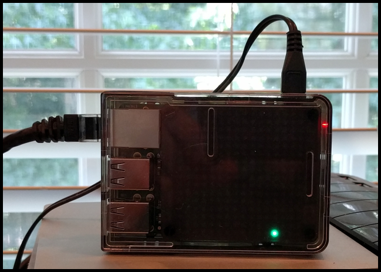
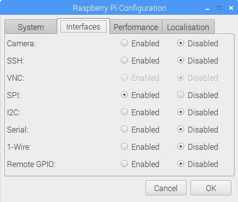

# Raspberry Pi Appointment Reminder (HD)

I often find myself missing appointments because I'm engrossed in my work or because I've switched to a different computer and can't hear the reminder ping on my work laptop. I created this project to give me a visual reminder, an obnoxious, silent countdown timer I can set on my desk to flash lights at me as a warning before my next meeting starts.

The project uses a network connected Raspberry Pi and a [Pimoroni Unicorn HAT HD](https://shop.pimoroni.com/products/unicorn-hat-hd) to flash the reminder. The project was originally built using the Pimoroni Unicorn HAT, and published in Make Magazine (makezine.com): [Get a Flashing Meeting Reminder with a Raspberry Pi](http://makezine.com/projects/get-a-flashing-meeting-reminder-with-a-raspberry-pi/). For this version, I upgraded the Unicorn HAT to the High Definition (HD) version which will allow me to display much cleaner and more interesting color patterns. The HD version of the Unicorn HAT has 256 LEDs vs the original Unicorn HAT's 64, for much higher pixel resolution.

One of the things I wanted to do in the original project was display the meeting description/subject on the Unicorn HAT. I could have done it, but because of the low pixel resolution of the Unicorn HAT, it would have looked clunky. The Unicorn HAT HD has a higher pixel resolution, so I've added the feature here. 

## Alerts

The Pi connects to Google Calendar and checks every minute for upcoming appointments then flashes the Unicorn HAT's LEDs for following alerts:

* **White** @ 10 minutes until 5 minutes
* **Yellow** @ 5 minutes until 2 minutes
* **Multi-color swirl** @ 2 minutes

If you're feeling adventurous, you can change the code to use any of the sample patterns included with the [Unicorn HAT HD Sample Code](https://github.com/pimoroni/unicorn-hat-hd/tree/master/examples).  I'm personally a big fan of the star field example, but that's not very useful as an alerting mechanism.

## Indicator LED

The project displays a single indicator LED to let you know the app is working. It will illuminate a single LED along the bottom row of the Unicorn HAT and move the LED across the display every time it connects to Google to obtain calendar information. The color of the LED indicates status of the app as well:

* **Blue** - The app is connecting to the Google Calendar API
* **Green** - The app received data from the Google Calendar API, but there are no pending appointments within the next 10 minutes
* **Red** - The app encountered an error connecting to the Google Calendar API
* **White** - There is an appointment beginning within 10 minutes
* **Yellow** - There is an appointment beginning within the next 5 minutes
* **Orange** - There is an appointment beginning within the next 2 minutes

This way, even if you miss the flashing lights, you can glance at the display and still determine if you have an upcoming appointment.

## Required Components

For this project, I used the following components:

+ [Raspberry Pi 3](https://www.raspberrypi.org/), but most any Pi will work. Check the Unicorn HAT documentation for supported Pi devices.
+ [Pimoroni Unicorn HAT HD](https://shop.pimoroni.com/products/unicorn-hat-hd)
+ [Adafruit Raspberry Pi B+ / Pi 2 / Pi 3 Case - Smoke Base - w/ Clear Top](https://www.adafruit.com/products/2258)
+ [CanaKit 5V 2.5A Raspberry Pi 3 Power Supply / Adapter / Charger (UL Listed)](http://www.amazon.com/CanaKit-Raspberry-Supply-Adapter-Charger/dp/B00MARDJZ4) from Amazon

## Google Calendar API Setup

Before you start, you must setup an account with Google so the app can consume the Google Calendar APIs used by the project. To setup your account, read the [Google Calendar API Python Quickstart](https://developers.google.com/google-apps/calendar/quickstart/python).

At the conclusion of the Google account setup process, download your Google Calendar API application's `client_secret.json` file, you'll need to copy the file to the Pi Reminder project folder later.. Be sure to name the downloaded file using that file name. The project's code uses this file to authorize access your Google Calendar and that file name is hard coded into the project's Python app.

## Raspberry Pi Setup

We'll start by connecting all the hardware, then move on to the software setup.

### Hardware

To setup the hardware, complete the following steps:

1. Mount the Pimoroni Unicorn HAT HD on the Raspberry Pi device using the included hardware
2. Place the Pi in a case
3. Power it up!

That's it, you're done. That was easy! When you're done, the Pi will look something like the following:

When the Pi boots up, log into the Pi using the default credentials (`pi`/`raspberry`). Next, you must change the Pi's hardware configuration so it can talk to the Unicorn HAT HD using the SPI protocol. Open the Pi menu (located in the upper-left corner of the screen), select **Preferences**, then **Raspberry Pi Configuration**. In the application that opens, select the **Interfaces** tab, then enable the **SPI** option as shown in the following figure:

Click the **OK** button to save your changes.  You should **not** have to reboot your Pi after completing this step. 

### Software

When the Pi is all ready to go, open a terminal window and update the device's software using the following commands:

	sudo apt-get update
	sudo apt-get upgrade

The first command updates the local software repositories and the second command updates the Pi's Raspbian OS and associated files.

Next, install the [Google Calendar API Python files](https://developers.google.com/api-client-library/python/start/installation) along with date handling libraries using the following command:

    sudo pip install --upgrade google-api-python-client python-dateutil pytz

Install the Unicorn HAT libraries following the instructions on the [Pimoroni web site](https://github.com/pimoroni/unicorn-hat-hd). Basically, open a terminal window and execute the following command:

    curl -sS get.pimoroni.com/unicornhathd | bash

Next, download the project's code; in the same terminal window, execute the following commands:

	git clone https://github.com/johnwargo/pi-remind-hd
	cd pi-remind-hd
	ls

If all goes well, you should see the following files in the folder:

- `LICENSE`
- `readme.md` (this file)
- `remind.py`
- `start-remind.sh`

Copy your personal `client_secret.json` file (downloaded when you created your Google account) to the `pi-remind-hd` folder you just created. With everything in place, execute the reminder app using the following command:

    sudo python ./remind.py

Before the app can access the calendar, you'll need to authorize the app to use the Google Calendar API for your calendar account. When you launch the app for the first time (using the command shown above) the browser will launch and walk you through the process. With that complete, PI Remind should start watching your calendar for events.

Note: if you ever change Google calendars (from a work to a personal calendar or from one work calendar profile to another) you'll need to whack the existing access token created during the initial startup or the Pi Reminder app. Instructions for deleting this token are available on [johnwargo.com](http://www.johnwargo.com/index.php/microcontrollers-single-board-computers/pi-reminder-%E2%80%93-delete-google-calendar-access-authorization-token.html).

## Starting The Project's Application's Automatically

There are a few steps you must complete to configure the Raspberry Pi so it executes the the reminder app on startup. You can read more about this here: [Autostart Python App on Raspberry Pi in a Terminal Window](http://johnwargo.com/index.php/microcontrollers-single-board-computers/autostart-python-app-on-raspberry-pi-in-a-terminal-window.html).

***Note:** Don't forget to authorize the Google Calendar API to access your Google Calendar by running the manual startup process described in the previous session before enabling autostart.* 

If you don't already have a terminal window open, open one, then navigate to the folder where you extracted the project files (if you followed my earlier instructions, you should have the files in `/home/pi/pi-remind-hd/`). Make the project's bash script files executable by executing the following command:

    chmod +x start-remind.sh
    
Next, you'll need to open the pi user's session autostart file using the following command:  

	sudo nano ~/.config/lxsession/LXDE-pi/autostart    

Add the following lines to the end (bottom) of the file:

	@lxterminal -e /home/pi/pi-remind-hd/start-remind.sh

To save your changes, press `ctrl-o` then press the Enter key. Next, press `ctrl-x` to exit the `nano` application.
  
Reboot the Raspberry Pi; when it restarts, the python remind process should execute in its own terminal window.

## Known Issues

Reminders are triggered for canceled events. If you have your Google Calendar configured to show deleted events, `pi_remind` will flash its lights for those events as well. I've tried setting `showDeleted` to `false` in the API call to get the calendar entry list from Google, but it does not seem to have an effect (in my testing anyway).

## Revision History

Nothing Yet!

***

You can find information on many different topics on my [personal blog](http://www.johnwargo.com). Learn about all of my publications at [John Wargo Books](http://www.johnwargobooks.com). 